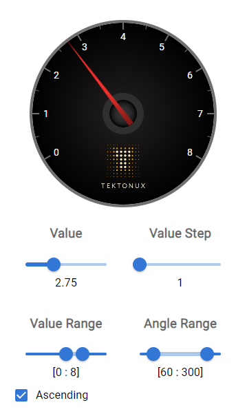

# Gauge Control

The Gauge control was developed as a demonstration of a reusable UI component.

## Usage

To use this component simply import and declare an instance of the control:
```
import { Gauge } from './features/gauge/Gauge';

<Gauge
    startAngle={240}
    endAngle={480}
    startValue={0}
    endValue={8}
    stepValue={1}
    value={value}
    updateInterval={200}
/>
```

## Parameters

### Start Value / End Value / Step Value
The range of displayed numbers rendered clockwise around the control. Each major tick is controlled by the step, which defaults to 1. Ascending and descending ranges are supported.

### Start Angle / End Angle
The angle range in degrees over which the number scale will be displayed. Range must be ascending.

### Value
The value at which the dial will point. Values falling outside the the start value / end value range will be clamped to the corresponding end.

### Update Interval
The time in milliseconds the dial will take to smoothly rotate to a new value. If set to zero, the gauge will instantly update on value change.

## Screenshot
The following shows the gauge with dev tools for demonstrating the input parameters.




## Dev setup

In the project directory, you can run:

### `npm start`

Runs the app in the development mode.\
Open [http://localhost:3000](http://localhost:3000) to view it in the browser.

The page will reload if you make edits.\
You will also see any lint errors in the console.
